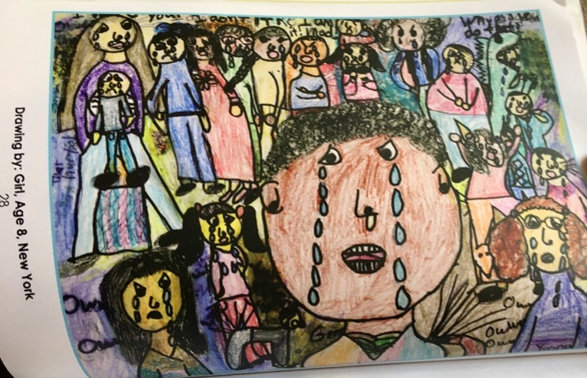
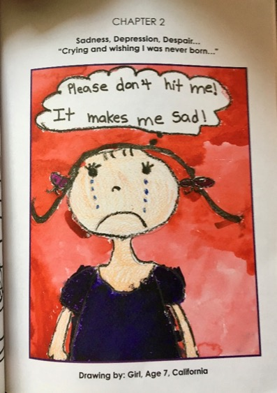
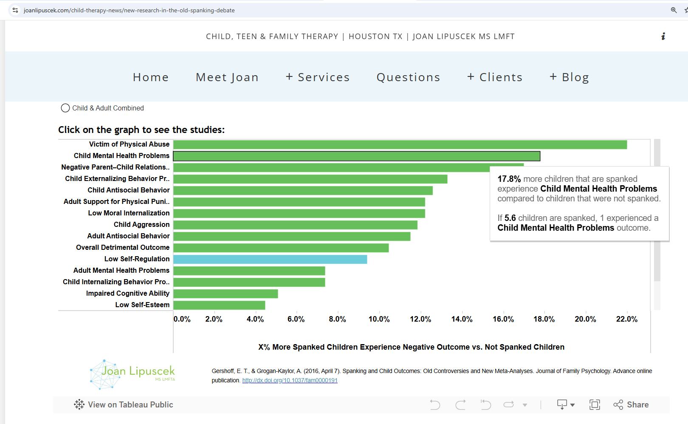
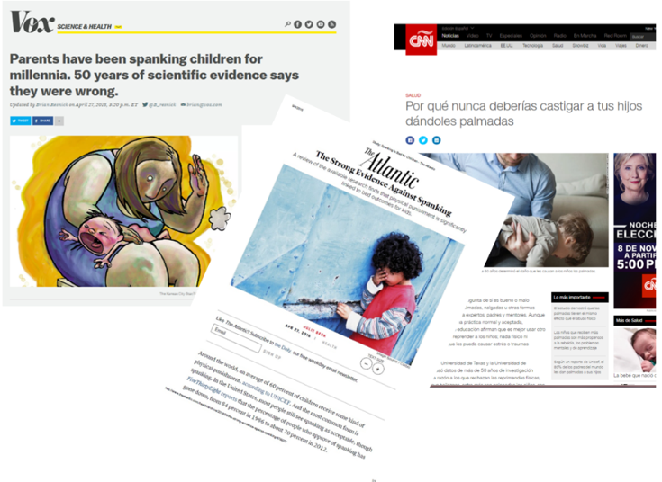

## Acknowledgments

* Professor Julie Ma
* Professor Shawna Lee
* Professor Liz Gershoff
* Professor Emerita Joan Durant
* Nadine Block
* Professors Jorge Cuartas
* Professor Dana McCoy 

## What This Talk Is About {.leftjustify}

::: {.incremental}
* "Physical Discipline"
* "Corporal Punishment" 
* "Spanking"

* All of these are roughly synonymous.  They are widely used forms of discipline worldwide.  

* There is a lot of research evidence around the use of spanking or physical punishment, but family decisions about whether to use physical punishment are often considered to be a personal matter.  
:::

## Outline of the Talk {.incremental}

::: {.incremental}
* Trends in the research.  
* All of this conversation is nested in a global conversation.  
* I would like to end, where we should always end a discussion of these issues, with a discussion of positive parenting.  What can parents do in these situations?  
:::

## How Spanking Feels to Children

Nadine Block, Center for Effective Discipline

::: {layout-ncol=2}
{width=45%}

{width=45%}
:::

## Meta-Analysis of 50 Years of Research on Corporal Punishment {.smaller .incremental}

::: {.incremental}
* @Gershoff2016
* Study of studies
* We screened 1,574 articles
* 50 years of research
* 111 unique “effect sizes” (study results)
* 160,927 children
* Remarkably consistent results. "There is no debate."
* 13 of 17 outcomes displayed statistically significant negative (undesirable results). 
* For no outcome was there a benefit of spanking.
* Only 1 study showed a statistically significant benefit of spanking.
:::

## Meta-Analytic Results

```{r}
#| fig-height: 5
#| echo: false
#| message: false
#| warning: false

library(readr)

CP_Meta_summary_results <- read_csv("CP-Meta-summary-results.csv")

library(ggplot2)

library(plotly)

p1 <- ggplot(CP_Meta_summary_results,
             aes(x = reorder(Outcome, d),
                 y = d,
                 label = Outcome,
                 fill = d)) + 
  geom_bar(stat = "identity") +
  scale_fill_viridis_c() +
  coord_flip() +
  labs(title= "Effect Sizes of Physical Punishment",
       x = "Outcome",
       y = "Cohen's d Effect Size",
       caption = "Gershoff and Grogan-Kaylor, 2016") +
  theme(legend.position = "none",
        title = element_text(size = rel(.5)),
        axis.text = element_text(size = rel(.75)))

ggplotly(p1, tooltip = c("fill", "label"))

```

## Thinking More Critically About the Size of Effects

Joan Lipuscek has written a [really nice blog post thinking through some of the issues raised by our research](https://www.joanlipuscek.com/child-therapy-news/new-research-in-the-old-spanking-debate). In particular, she thinks very critically about the sizes of effects.



## Response to Meta-Analysis



* Over 100 mentions in English language news media.
* University of Michigan News indicates that the press release from UM News received "more than 100 hits in Spanish, 60 in Chinese, 43 in Portuguese and 23 in India."

## Impact {.incremental}

::: {.incremental}
* Policy Statement by *American Academy of Pediatrics*
* Policy Statement by *American Psychological Association*
:::

## Global Research on Corporal Punishment {.smaller}

```{r}
#| eval: true
#| echo: false

library(readr) # get data

# library(haven) # Stata data

# library(ggplot2) # beautiful graphs

library(dplyr) # data wrangling

library(tidyr) # tidy data

# library(DT) # nice data table

library(tibble) # tibbles

library(countrycode) # manage country data

# library(plotly) # interactive graphs

# library(maps) # maps

library(leaflet) # web maps

# library(sp) # spatial data

library(sf) # simple features

```

```{r}
#| eval: true
#| echo: false

global_data <- read_sf("../mapping/shapefiles/wrld_simpl/wrld_simpl.shp") 

# get MICS countries

country <- c("Afghanistan", "Algeria",  "Argentina",  
             "Bangladesh",  "Barbados",  "Belarus",  
             "Belize",  "Benin",  "Bosnia and Herzegovina",  
             "Cameroon",  "Central African Republic",  "Chad",  
             "Democratic Republic of the Congo",  
             "Republic of the Congo",  
             "Costa Rica",  "Cote d'Ivoire",  
             "Dominican Republic",  
             "El Salvador",  "Eswatini",  "Ghana",  
             "Guinea",  "Guinea Bissau",  "Guyana",  
             "Iraq",  "Jamaica",  "Kazakhstan",  
             "Kenya",  "Kosovo",  "Kyrgyzstan",  
             "Laos", "Macedonia",  "Madagascar",  
             "Malawi",  "Mali",  "Mauritania",  
             "Mexico",  "Moldova",  "Mongolia",  
             "Montenegro",  "Nepal",  "Nigeria",  
             "Pakistan",  "Panama",  "Paraguay",  
             "Sao Tome and Principe",  "Senegal",  "Serbia",  
             "Sierra Leone",  "Somalia",  "St. Lucia",  
             "State of Palestine",  "Suriname",  "Thailand",  
             "The Gambia",  "Togo",  "Trinidad and Tobago",  
             "Tunisia",  "Turkmenistan",  "Ukraine",  
             "Uruguay",  "Vietnam",  "Zimbabwe")

# convert to ISO3

country_iso <- countrycode(country, 
                           'country.name', 
                           'iso3c')

# MICS is an sf object that is subset of global_data

MICS <- global_data %>% 
  filter(ISO3 %in% country_iso)
  
```

```{r}
#| eval: true
#| echo: false
#| fig-cap: "Locations of Countries in UNICEF MICS Data"
#| fig-height: 3

library(leaflet)

leaflet() %>%
  setView(0, 0, zoom = 1.5) %>%
  # addTiles() %>%
  addProviderTiles(providers$Esri.WorldImagery) %>%
  addPolygons(data = MICS, 
              fillOpacity = .75, 
              color = "#5b92e5", 
              label = MICS$NAME,
              highlightOptions = highlightOptions(color = "red", 
                                                  weight = 2,
                                                  bringToFront = TRUE)) 

```

e.g. @Pace2019, @Ward2022LCA, @Ward2023

## A Cascade of Bans on Corporal Punishment

```{r call_libraries}
#| eval: true
#| echo: false
#| output: false
#| warning: false

library(readr) # get data

library(countrycode) # code country names

library(dplyr) # data wrangling

library(tibble) # library for updated dataframes

library(plotly) # interactive plots

```

```{r get_data}
#| eval: true
#| echo: false

cpbans <- tribble( 
  ~type, ~year.of.prohibition, ~country, ~country_code, ~total.number.of.bans,
  "CP Ban", 2025, "Switzerland", "CHE", 70,
  "CP Ban", 2025, "Czech Republic", "CZE", 69,
  "CP Ban", 2025, "Thailand", "THA", 68,
  "CP Ban", 2024, "Tajikistan", "TJK", 67,
  "CP Ban", 2024, "Lao PDR", "LAO", 66,
  "CP Ban", 2022, "Mauritius", "MUS", 65,
  "CP Ban", 2022, "Zambia", "ZMB", 64, 
  "CP Ban", 2021, "Colombia", "COL", 63, 
  "CP Ban", 2021, "Korea", "KOR", 62, 
  "CP Ban", 2021, "Guinea", "GIN", 61, 
  "CP Ban", 2020, "Seychelles", "SYC", 60, 
  "CP Ban", 2019, "Japan", "JPN", 59, 
  "CP Ban", 2019, "Georgia", "GEO", 58, 
  "CP Ban", 2019, "South Africa", "ZAF", 57, 
  "CP Ban", 2019, "France", "FRA", 56, 
  "CP Ban", 2019, "Kosovo", "RKS", 55, 
  "CP Ban", 2018, "Nepal", "NPL", 54, 
  "CP Ban", 2016, "Montenegro", "MNE", 53, 
  "CP Ban", 2017, "Lithuania", "LTU", 52, 
  "CP Ban", 2016, "Slovenia", "SVN", 51, 
  "CP Ban", 2016, "Paraguay", "PRY", 50, 
  "CP Ban", 2016, "Mongolia", "MNG", 49, 
  "CP Ban", 2015, "Peru", "PER", 48, 
  "CP Ban", 2015, "Ireland", "IRL", 47, 
  "CP Ban", 2015, "Benin", "BEN", 46, 
  "CP Ban", 2015, "Andorra", "AND", 45, 
  "CP Ban", 2014, "Nicaragua", "NIC", 44, 
  "CP Ban", 2014, "Estonia", "EST", 43, 
  "CP Ban", 2014, "San Marino", "SMR", 42, 
  "CP Ban", 2014, "Argentina", "ARG", 41, 
  "CP Ban", 2014, "Cape Verde", "CPV", 40, 
  "CP Ban", 2014, "Bolivia", "BOL", 39, 
  "CP Ban", 2014, "Brazil", "BRA", 38, 
  "CP Ban", 2014, "Malta", "MLT", 37, 
  "CP Ban", 2013, "Honduras", "HND", 36, 
  "CP Ban", 2013, "Macedonia", "MKD", 35, 
  "CP Ban", 2011, "South Sudan", "SSD", 34, 
  "CP Ban", 2010, "Albania", "ALB", 33, 
  "CP Ban", 2010, "Congo", "COG", 32, 
  "CP Ban", 2010, "Kenya", "KEN", 31, 
  "CP Ban", 2010, "Tunisia", "TUN", 30, 
  "CP Ban", 2010, "Poland", "POL", 29, 
  "CP Ban", 2008, "Liechtenstein", "LIE", 28, 
  "CP Ban", 2008, "Luxembourg", "LUX", 27, 
  "CP Ban", 2008, "Moldova", "MDA", 26, 
  "CP Ban", 2008, "Costa Rica", "CRI", 25, 
  "CP Ban", 2007, "Togo", "TGO", 24, 
  "CP Ban", 2007, "Spain", "ESP", 23, 
  "CP Ban", 2007, "Venezuela", "VEN", 22, 
  "CP Ban", 2007, "Uruguay", "URY", 21, 
  "CP Ban", 2007, "Portugal", "PRT", 20, 
  "CP Ban", 2007, "New Zealand", "NZL", 19, 
  "CP Ban", 2007, "Netherlands", "NLD", 18, 
  "CP Ban", 2006, "Greece", "GRC", 17, 
  "CP Ban", 2005, "Hungary", "HUN", 16, 
  "CP Ban", 2004, "Romania", "ROU", 15, 
  "CP Ban", 2004, "Ukraine", "UKR", 14, 
  "CP Ban", 2003, "Iceland", "ISL", 13, 
  "CP Ban", 2002, "Turkmenistan", "TKM", 12, 
  "CP Ban", 2000, "Germany", "DEU", 11, 
  "CP Ban", 2000, "Israel", "ISR", 10, 
  "CP Ban", 2000, "Bulgaria", "BGR", 9, 
  "CP Ban", 1999, "Croatia", "HRV", 8, 
  "CP Ban", 1998, "Latvia", "LVA", 7, 
  "CP Ban", 1997, "Denmark", "DNK", 6, 
  "CP Ban", 1994, "Cyprus", "CYP", 5, 
  "CP Ban", 1989, "Austria", "AUT", 4, 
  "CP Ban", 1987, "Norway", "NOR", 3, 
  "CP Ban", 1983, "Finland", "FIN", 2, 
  "CP Ban", 1979, "Sweden", "SWE", 1, 
)

```

```{r make_globe}
#| eval: true
#| echo: false

plot_geo(cpbans) %>% 
  add_trace(locations = ~country_code, 
            color = ~year.of.prohibition,
            z = ~year.of.prohibition, 
            text = ~paste(country, 
                          "<br>year of prohibition:", 
                          year.of.prohibition),
            hoverinfo = "text",
            marker = list(size = 10)) %>%
  layout(title = "Countries With Bans on Corporal Punishment of Children",
         geo = list(showland = FALSE,
                    showcountries = TRUE,
                    projection = list(type = 'orthographic',
                                      rotation = list(lon = -30,
                                                      lat = 10,
                                                      roll = 0)
                                      ))) %>%
  colorbar(title = 'year of prohibition') 

```


## What Can Parents Do? {.smaller .incremental}

::: {.incremental}
* Parenting is a "long game," rather than a "short game". Growing rigorous evidence that ongoing love and support are the strongest shapers of positive behavior.
* Well studied in the U.S.
* Growing attention in global research.
* "Catch children being good". Praise.
* Age appropriate removal of privileges.
* Spend time with children.
* Let children know you love them.
* Listen to children. Think about where children are in terms of their developmental tasks.
* [https://resourcecentre.savethechildren.net/library/positive-discipline-everyday-parenting-pdep-fourth-edition](https://resourcecentre.savethechildren.net/library/positive-discipline-everyday-parenting-pdep-fourth-edition) 
:::

## Questions? {.center background-color="#00274C"}

## References


